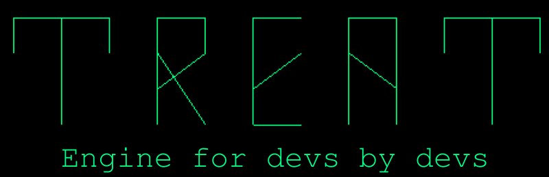

# Treat Engine




## What is Treat Engine?
Treat Engine is a simple but powerful 2D engine, oriented toward indie devs.

It uses **Python** as the *scripting language* and **ModernGL** as the *rendering API*,
making development simple and giving you full control over the hardware.

It is distributed as open-source under the GPL 2.0 licence - highly recommend 
giving it a read before forking the engine ;)


## Features

- **Python Scripting** - Write game logic in familiar Python syntax
- **ModernGL Rendering** - Hardware-accelerated OpenGL graphics
- **Cross-Platform** - Windows, Linux, macOS support
- **2D Graphics** - Sprite rendering, textures, and animations
- **Lightweight Architecture** - Minimal overhead, fast startup times


## Installation

### Automated:
1. Clone repository:  
```bash
git clone https://github.com/MiraDiv-git/Treat-Engine.git
```
2. Simply run **install.sh** on _Linux / macOS_ or **install.bat** on _Windows_.
Let the scripts do all work for you :)

### Manual:
1. Clone repository:  
```bash
git clone https://github.com/MiraDiv-git/Treat-Engine.git
```
2. Create virtual environment inside this folder:
```bash
python -m venv .venv
```
3. Install dependencies:
```bash
./.venv/bin/pip install -r requirements.txt # on Linux / macOS
.venv\Scripts\pip.exe install -r requirements.txt # on Windows
```
Also install TKInter support on Linux / macOS:
```bash
sudo apt install -y python3.13-tk # Ubuntu / Debian
sudo yum install -y python3.13-tkinter # RHEL / CentOS
sudo dnf install -y python3.13-tkinter # Fedora
sudo pacman -S --noconfirm tk # Arch
brew install python-tk@3.13 # macOS using Homebrew
```
4. Run Treat Engine:

```bash
./run.sh # on Linux / macOS
run.bat # on Windows
```
Or run it manually:
```bash
./.venv/bin/python main.py # on Linux / macOS
.venv\Scripts\python.exe main.py # on Windows
```
You can also check the [Releases](https://github.com/MiraDiv-git/Treat-Engine/releases) page for 
compiled executable files


## Building
Treat Engine uses [Nuitka](https://nuitka.net/) for compilation.

To build the project into executable file, use automated scripts in [build](build) folder.

If you prefer to build it manually, here are the minimal commands:
```bash
# On Linux / macOS
./.venv/bin/nuitka main.py --onefile --include-data-dir=shaders=shaders --output-dir=./build/unix

# On Windows (make sure you have Visual Studio Build Tools installed)
.venv\Scripts\nuitka.cmd main.py --onefile --include-data-dir=shaders=shaders --output-dir=.\build\windows
```
The --output-dir flag specifies the directory where the compiled files will be generated.
You can omit it — in that case, the files will be placed directly in the project root.


## Support the project
[](https://ko-fi.com/L3L21FDZL2)


## Documentation
There will be docs. Someday


## Roadmap

### Current Version (v0.1 - Alpha)
- [ ] Basic rendering pipeline
- [ ] Python scripting integration
- [ ] Asset loading (textures, sounds)
- [ ] Sprite rendering system
- [ ] Input handling (keyboard/mouse)

### v0.2 - Core Features
- [ ] Audio system
- [ ] Basic collision detection
- [ ] Scene management
- [ ] Live Reload system
- [ ] Basic error handling/logging system

### v0.3 - Basic GUI Editor
- [ ] Render preview
- [ ] Scene editor
- [ ] Object hierarchy
- [ ] Built-in explorer
- [ ] Debug renderer
- [ ] Performance profiler
- [ ] Documentation website
- [ ] Sprite editor
- [ ] Tile Grid
- [ ] Build profiles

### v0.4 - Advancing Features
- [ ] Object inspector
- [ ] Sprite animation system
- [ ] Positional audio
- [ ] Audio mixer
- [ ] Tilemap editor
- [ ] UI system
- [ ] Text system
- [ ] More options in build profiles
- [ ] Responsive UI scaling

### v0.5 - Component System
- [ ] Adjustable camera
- [ ] Collider components
- [ ] UI objects (Buttons, Sliders, etc)
- [ ] 2D Physics
- [ ] Dialogue dynamic component
- [ ] Save/Load system
- [ ] Settings management
- [ ] Gamepad support

### v1.0 - Stable Release
- [ ] Complete API documentation
- [ ] Example games and tutorials
- [ ] Performance optimizations
- [ ] Cross-platform builds

### Future Ideas
- Plugin system
- Shader editor
- Steam integration
- Mobile platform support
- Advanced 2D Lighting system

*Roadmap is subject to change based on community feedback and development priorities*


## Contributing

We welcome contributions to Treat Engine! Here's how you can help:

### Ways to contribute:
- **Report bugs** — open an issue with detailed description
- **Suggest features** — share your ideas in discussions
- **Improve documentation** — fix typos, add examples
- **Submit code** — bug fixes, new features, optimizations

### Before contributing:
1. Check existing issues to avoid duplicates
2. For major changes, open an issue first to discuss
3. Follow the existing code style
4. Test your changes thoroughly

### Pull Request process:
1. Fork the repository
2. Create a feature branch (`git checkout -b feature/amazing-feature`)
3. Commit your changes (`git commit -m 'Add amazing feature'`)
4. Push to branch (`git push origin feature/amazing-feature`)
5. Open a Pull Request

**Note:** By contributing, you agree that your contributions will be licensed under GPL 2.0


## License
Copyright (C) 2025 Terokhin Myroslav (MiraDiv)

This project is distributed under [GNU General Public License v.2.0](LICENSE)

However, the games or applications developed using Treat Engine **are not required to be 
licensed under the GPL**. You may license your games under any terms of your choice, 
provided you do not modify and redistribute the Treat engine itself.

See [GPL Exception](GPL_EXCEPTION) for details.


## Contact
If you have questions or suggestions — feel free to *open an issue*
or contact me via DM